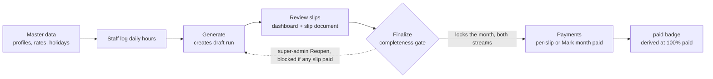

# Payroll — HR / admin operator guide

The month's payroll in one page: what must be true before a run, how a run is
started, locked and paid, and what to check when a number looks wrong.

The money is **hours-based** (ADR-0010): a Payroll Slip pays the Salary
Profile's CTC apportioned over the month's working hours, at the hours the
employee logged on project activities.

```
Gross (base)  = Hourly Rate × Logged Hours
Hourly Rate   = CTC ÷ Basis Hours
Basis Hours   = month's working days × std_hours_per_day (default 8)
Logged Hours  = Σ user_activity_assignments.daily_entries.hours, that calendar month
```

- **CTC** = `employee_salary_profile.employer_cost`, falling back to
  `gross_salary`, then `gross` — the same chain the utilization and cost
  reports call Monthly Cost.
- **Working days** exclude Sundays and active `holiday_master` holidays
  (`getWorkingDaysForMonth`), so Basis Hours change month to month and the
  rate with them.
- **Attendance** (`employee_attendance`) is printed on the slip (Total/Present
  days, PL used, absent days) but no longer adds or subtracts money: no
  overtime premium, no absence pro-rata. Unpaid absence costs pay only because
  those hours were never logged.
- **Zero logged hours = ₹0 slip.** This is the single most important
  operational consequence.
- Rounding: the slip stores the rate at 2 dp (`hourly_rate`) while the money
  math uses the unrounded rate, so a fully logged month pays exactly the CTC —
  ₹26,000 CTC over 208 h pays ₹26,000 for 208 h, not ₹25,999.84. Gross rounds
  to whole rupees like every other payroll figure.
- The dashboard/slip **Gross column is the slip's total earnings** — basic, da,
  hra, conveyance, call allowance, other allowances, bonus and incentive. The
  profile's **Other Allowances** sit outside the hours-based base and are added
  on top of it.

### Worked example

| Input                                    | Value              |
| ---------------------------------------- | ------------------ |
| CTC (`employer_cost`)                    | ₹26,000            |
| Month working days × `std_hours_per_day` | 26 × 8 = **208 h** |
| Hours logged on activities               | **104 h**          |

| Output                               | Value                                                            |
| ------------------------------------ | ---------------------------------------------------------------- |
| Hourly Rate                          | ₹125.00                                                          |
| Gross (base)                         | ₹13,000 (104 × 125)                                              |
| Basic + DA (60 %)                    | ₹7,800                                                           |
| HRA / Conveyance / Call (20/10/10 %) | ₹2,600 / ₹1,300 / ₹1,300                                         |
| Net Pay                              | Gross base + Other Allowances − PF/ESIC/PT/MLWF/TDS/loan/advance |

## The month's lifecycle



One Payroll Run covers the whole month, both Employee Type streams. There are
no off-cycle runs: a correction after payment flows into the next month's run
as arrears (ADR-0008).

## Entry points

| Screen                                         | Route                                  | Who                        | What they do                                                                                                      |
| ---------------------------------------------- | -------------------------------------- | -------------------------- | ----------------------------------------------------------------------------------------------------------------- |
| Payroll Run (dashboard)                        | `/admin/payroll`                       | admin, super-admin         | month picker, Payroll\|Contract toggle, Generate, Finalize, Reopen, Mark month paid, exports, per-employee review |
| Payroll Slip                                   | `/admin/payroll/slips/[id]`            | admin, super-admin         | the printable slip document (Print, Download PDF)                                                                 |
| Component Rates / DA Rates                     | `/admin/payroll/rates`, `/rates/da`    | admin, super-admin         | effective-dated DA, PT, MLWF, bonus, incentive, insurance rates                                                   |
| Salary Profiles (master data)                  | `/employees/payroll`                   | admin, super-admin         | pay agreements: CTC/gross, salary type, `std_hours_per_day`, statutory flags, loan/advance                        |
| Salary-slip table (per-slip payment + remarks) | `/reports`                             | payroll-permissioned users | `PUT /api/payroll/slips` per slip                                                                                 |
| My Payslips                                    | `/user/payslips`                       | employee                   | own finalized slips + PDF                                                                                         |
| Daily hours entry                              | project → Edit → **My Activities** tab | employee / PM              | the pay numerator (`daily_entries`)                                                                               |

The **My Payslips** card on `/user/dashboard` is hidden pending the feature's finalization; the `/user/payslips` route itself is unchanged.

`/admin/*` requires super-admin or role code `admin` (`src/app/admin/layout.tsx`);
every payroll API additionally checks `RESOURCES.PAYROLL` (generate needs
`CREATE`, listings `READ`), and only a super-admin may reopen. Old payroll URLs
(`/admin/salary-sheet`, `/admin/salary-slip`, `/admin/payroll-schedules`,
`/admin/da-schedule`, `/admin/payroll/slips`) permanently redirect.

## Before the run — prerequisites

| Prerequisite                                                                                       | Where                                                                                     | If missing                                                                                                                                       |
| -------------------------------------------------------------------------------------------------- | ----------------------------------------------------------------------------------------- | ------------------------------------------------------------------------------------------------------------------------------------------------ |
| Salary Profile with CTC and `std_hours_per_day`                                                    | `/employees/payroll` (Contract pay section for contract staff)                            | Finalize blocks and names the employee: no profile → nothing to compute. Without `employer_cost` the CTC chain falls back to the agreed gross    |
| Component Rates for the month                                                                      | `/admin/payroll/rates`                                                                    | DA falls back to the frozen config default (0 fixed); PT uses the statutory slab                                                                 |
| Holidays published                                                                                 | Attendance → Holiday Master                                                               | Basis Hours count a holiday as a working day                                                                                                     |
| Attendance entered                                                                                 | Attendance module                                                                         | Slip prints 0/absent days — money is unaffected                                                                                                  |
| Login account linked to the employee (`users.employee_id`), or `employee_id` on the assignment row | User Master / employee record                                                             | Assignment rows resolve by `employee_id` → linked user → email/username match; an unresolvable row's hours are dropped and the employee reads ₹0 |
| Daily hours logged by staff                                                                        | project → Edit → **My Activities** (nudged by the dashboard's "Activity Update Required") | ₹0 slip — HR's main pre-finalize check                                                                                                           |

## Running the month

1. Open `/admin/payroll`, choose the month, pick the **Payroll** or **Contract**
   stream.
2. **Generate Payroll Slips** (`POST /api/payroll/generate`) — creates the
   month's Payroll Run as `draft` on first use, then writes a slip per active
   employee of that stream who has a profile. **Employees who already have a
   slip are skipped** (`results.skipped`), so a recompute needs its slip deleted
   first (reopen a finalized month, then delete on `/reports`). `{ employee_id,
preview: true }` computes one slip without saving it.
3. **Review**: `Days / Present / Hrs Logged / Rate/Hr / Basic … Gross /
PF … Deductions / Net Pay / Status` per row, totals in the footer, Payment
   tile in the header. Click a name for the slip document. This is where a ₹0
   or short month must be caught — after Finalize it is frozen.
4. **Finalize Payroll Run** — confirmation summarizes headcount and totals. It
   refuses, naming everyone, while either group is outstanding:
   - active Payroll/Contract employees **with** a profile but **no slip**
     (fix: Generate again),
   - active Payroll/Contract employees **without** a profile (fix: master data).
     Finalizing locks the month for both streams against regeneration.
5. **Pay** — per-slip `pending/processed/paid/hold` + date + reference from
   `/reports`, or the dashboard's **Mark month paid** with a payment date for
   the whole month. The run badge reads `paid` automatically only when 100 % of
   the month's slips are paid (derived, never stored).
6. **Export** — **Export Excel** (`/api/payroll/export-sheet`, payroll grid or
   the 5-column contract sheet) and **Download All PDFs**
   (`/api/payroll/bulk-pdf`). A single slip's PDF goes through the same endpoint
   scoped to its employee.
7. **Correct a locked month** — super-admin **Reopen** returns the run to
   `draft` (refused while any slip in the month is paid), then delete the
   affected slip(s) on `/reports` (**Delete** per row, or **Delete all**), then
   **Generate Payroll Slips** again. Slip deletion is refused while the month's
   run is locked. Every run transition, payment change, slip deletion, Salary
   Profile edit and Component Rate edit is written to `payroll_audit_logs` with
   performer and old → new values.
8. **Employees** see their slips at `/user/payslips` once the month's run is
   finalized (months with no run row — historical slips — stay visible).

## When a number looks wrong

| Symptom                                  | Cause                                                                             | Fix                                                                           |
| ---------------------------------------- | --------------------------------------------------------------------------------- | ----------------------------------------------------------------------------- |
| ₹0 net pay                               | No `daily_entries` hours in that month, or the login/employee link is missing     | Have the hours logged, then Reopen → delete the slip on `/reports` → Generate |
| Rate differs from last month             | Basis Hours follow the month's working days                                       | Expected; compare `Hrs Logged × Rate/Hr` against Gross                        |
| `Hrs Logged 0` / `Rate —` on an old slip | Slip generated before the hours basis existed (columns NULL)                      | Historical snapshot — leave it, or regenerate a draft month                   |
| Gross ≠ CTC                              | Pay follows logged hours; CTC is the _full month_ equivalent (`full_month_gross`) | Expected                                                                      |
| Finalize refuses                         | Missing slips and/or missing profiles, named in the error                         | Generate again / write the profile                                            |
| Reopen refused                           | A slip in the month is paid, or you are not a super-admin                         | Corrections become next month's arrears                                       |
| Slip deletion refused                    | The month's run is finalized/paid                                                 | Reopen first (super-admin)                                                    |

## Where the code lives

| Concern                                                     | File                                                                                   |
| ----------------------------------------------------------- | -------------------------------------------------------------------------------------- |
| Pay formula, earnings split, statutory math                 | `src/utils/payroll-calculation.js`                                                     |
| Server orchestration: hours fetch, batch/insert, generation | `src/utils/payroll-calculator.js`                                                      |
| Run lock, completeness gates, paid derivation               | `src/app/api/payroll/_lib/payroll-run.js`, `runs/{finalize,reopen,mark-paid}/route.js` |
| Generate / preview API                                      | `src/app/api/payroll/generate/route.js`                                                |
| Slips listing + payment update                              | `src/app/api/payroll/slips/route.js`                                                   |
| Slip figures shared by every reader                         | `src/lib/payroll.js`                                                                   |
| Slip document (screen) / PDF                                | `src/components/payroll/PayrollSlipDocument.jsx`, `src/lib/slip-pdf.js`                |
| Hours-basis slip columns (ADR-0010)                         | `migrations/20260925120000_add_slip_hours_basis_columns.js`                            |

## Related

- ADR-0010 — pay is the month's CTC over its hours, paid at the hours logged.
- ADR-0009 — a slip's figures are its snapshot; readers never re-price it.
- ADR-0008 — Payroll Run lock, route tree, audit.
- ADR-0001 — Salary Profile is canonical; `salary_structures` is legacy fallback.
- `docs/explanations/activity-daily-entries.md` — the `daily_entries` data model
  and every write path for logged hours.
- `docs/explanations/RBAC_PERMISSIONS_SYSTEM.md` — payroll permissions.
